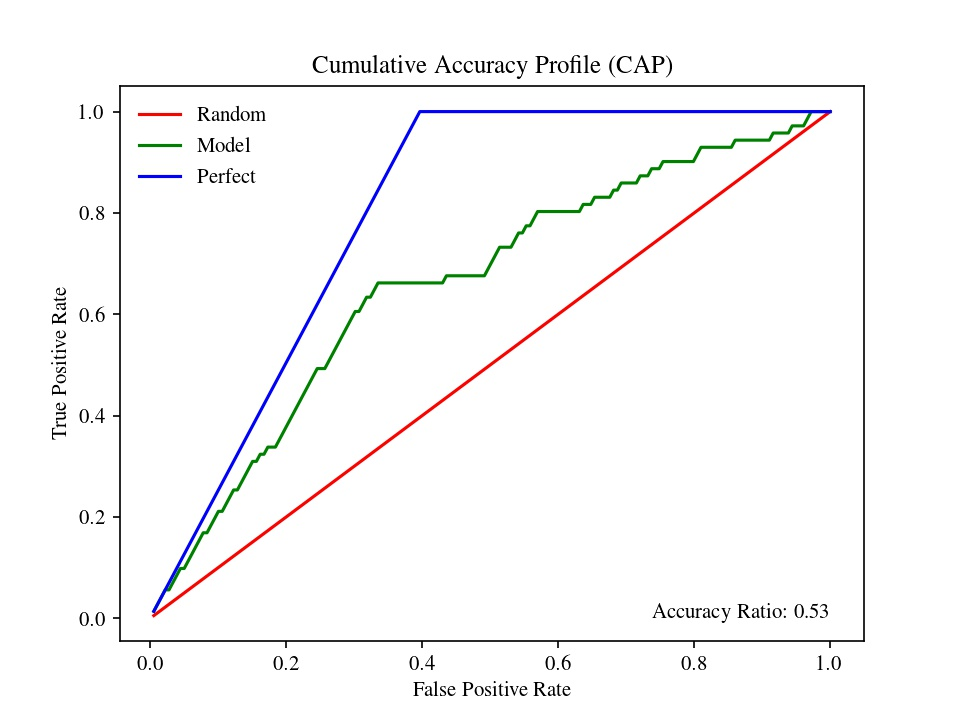

# Cumulative Accuracy Profile (CAP)
This python code is used to evaluate the performance of a binary classificator model.
It takes as input three columns, in this order: usedID, groundtruth_values, predicted_values.

Returns a visual representation of model performance with accuracy ratio (AUC).

 
    </img>

Tags: Machine Learning, Python, Binary Classifier
